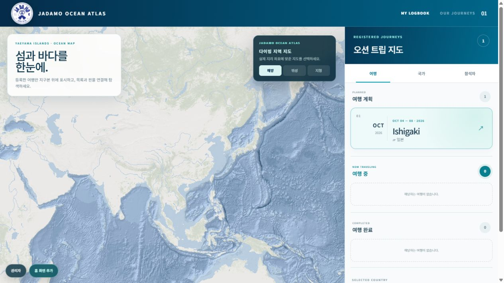
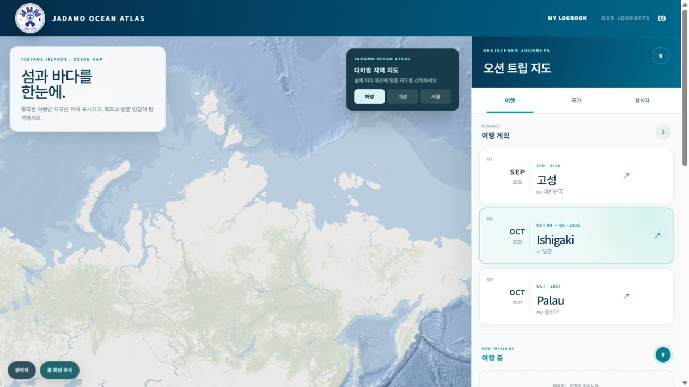
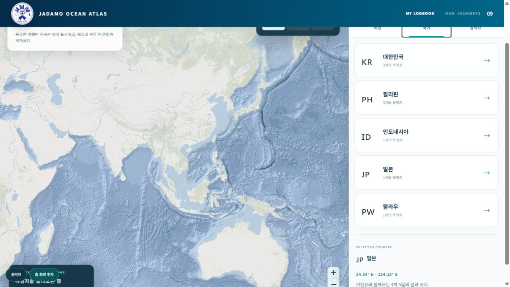
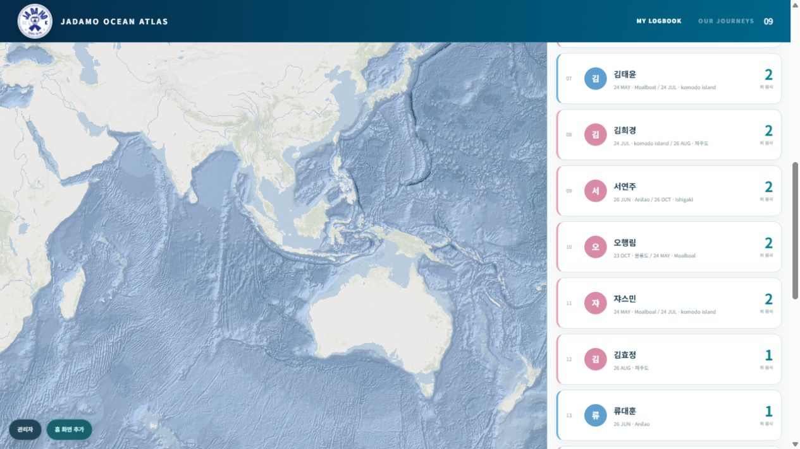
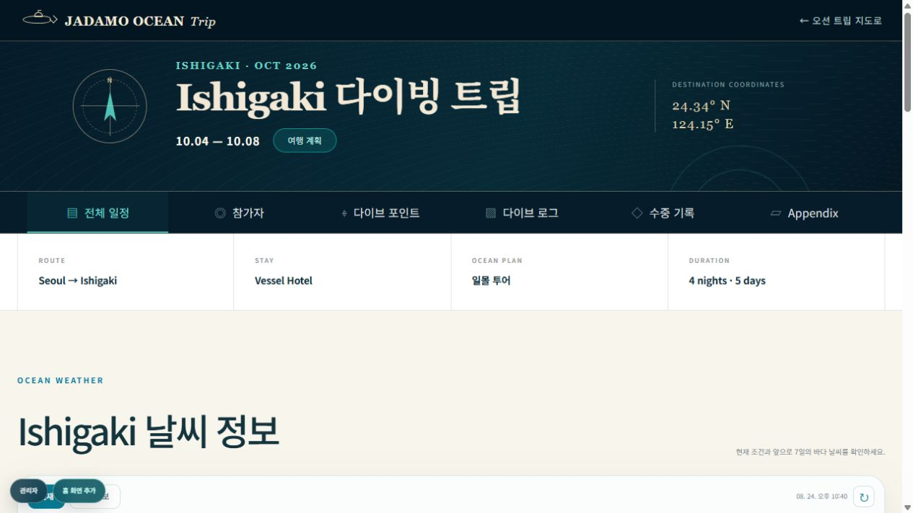
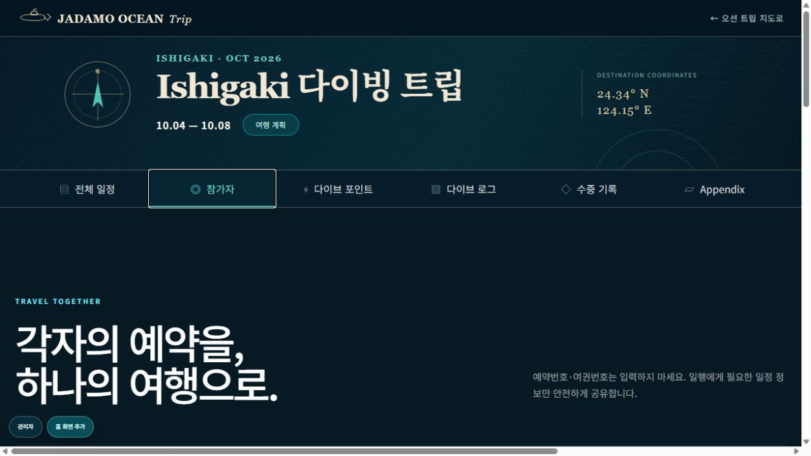
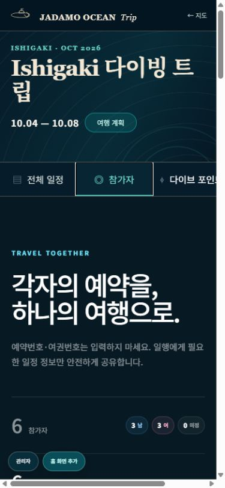
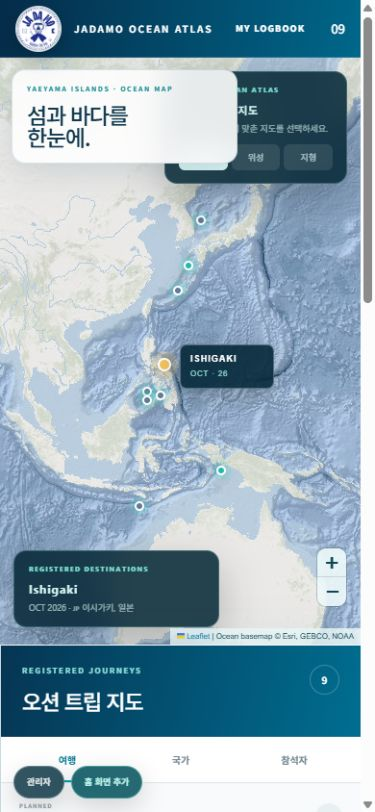
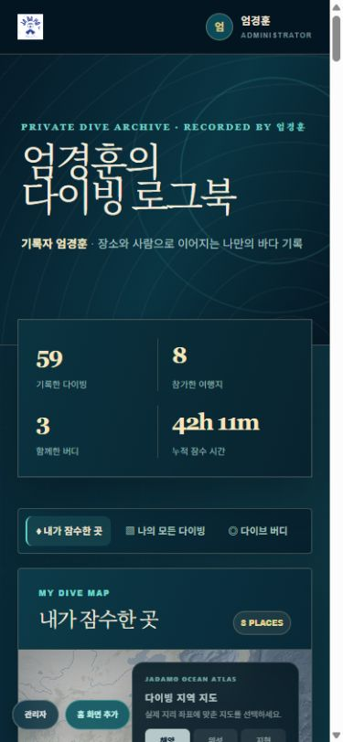

# JADAMO OCEAN Trip 디자인·오류 점검

- 점검일: 2026-08-24
- 대상: https://jadamo-trip.eomkun12.chatgpt.site/
- 범위: 홈, 지도 탐색 탭, Ishigaki 여행 상세, 참가자 화면, 로그북, 데스크톱·모바일 반응형
- 방식: 실제 배포 사이트 브라우저 점검, 콘솔 확인, 로컬 코드 정적 분석, 제한된 자동 테스트

## 총평

바다 지도와 편집형 여행 기록이라는 제품 성격을 유지하면서, 최초 데이터 깜빡임, 참가자 화면 가로 넘침, 모바일 홈 카드 충돌, 관리 버튼의 콘텐츠 가림을 모두 수정했다. 국가·참석자 탐색과 참가자 이름 읽기 순서의 접근성 문제도 바로잡았다. 공개 로그북은 실제 접근 방식에 맞게 개인 기록 문구로 정리하고 최근 여행 로그만 기본 펼침으로 변경했다. 수정 후 데스크톱과 모바일에서 가로 넘침과 카드 겹침이 없는 상태를 확인했다.

## 점검 단계

### 1. 홈 첫 진입 — 수정 완료·양호

- 강점: 지도와 여행 목록이 한 화면에서 연결되고, 선택 여행 카드가 분명하다.
- 수정: 실제 목적지 응답 전에는 수치와 카드 대신 명시적인 로딩 상태를 보여주고, 지도 데이터 전달도 로드 완료 뒤 시작하도록 변경했다.

### 2. 홈 데이터 로드 완료 — 양호

- 강점: 9개 여행이 계획·진행·완료로 구분되고, 카드 계층과 선택 상태가 명료하다.
- 개선: 데스크톱 오른쪽 패널의 세로 밀도가 높다. 완료 여행을 기본 접기 처리하면 지도 탐색 비중을 높일 수 있다.

### 3. 국가·참석자 탐색 — 수정 완료·양호

- 강점: 여행/국가/참석자라는 세 가지 탐색 모델은 유용하며 전환도 정상 동작한다.
- 수정: 목록 역할을 컨테이너로 옮기고 펼침 버튼의 상태와 대상 영역을 연결했다. 키보드 포커스는 브랜드 청록색으로 통일했다.

### 4. Ishigaki 여행 상세 — 양호

- 강점: 목적지, 기간, 상태, 좌표, 핵심 정보와 상세 메뉴의 계층이 강하다. 여행 상세 메뉴 전환도 정상 동작한다.
- 수정: 날씨 영역 상단 여백을 데스크톱 52px, 모바일 42px로 줄였다. 관리 바로가기는 문서 하단 도구 영역으로 옮겨 콘텐츠를 가리지 않는다.

### 5. 참가자 상세 — 수정 완료·양호

- 수정: 성별·날짜 선택 입력을 1px visually-hidden 패턴으로 변경하고 레이블에 키보드 포커스를 표시했다.
- 재검증: 데스크톱 1250px 문서 폭/1250px 콘텐츠 폭, 모바일 375px/375px로 가로 넘침이 0이다.
- 접근성: 참가자 제목에 `이름, 성별 남성/여성/미정` 형식의 명시적 레이블을 적용했다.

### 6. 모바일 홈 — 수정 완료·양호

- 강점: 지도 핀, 선택 목적지, 여행 목록이 세로 흐름으로 재배치되며 문서 자체의 가로 넘침은 없다.
- 수정: 소개 카드를 지도 레이어 카드 아래로 분리해 교차 영역이 0이 되도록 배치했다.
- 수정: 관리 바로가기를 문서 흐름의 하단 도구 영역으로 이동하고 버튼 높이를 44px로 확대했다.
- 수정: 모바일 브랜드와 로그북 이동 링크의 터치 높이를 44px 이상으로 확보했다.

### 7. 로그북 — 수정 완료·양호

- 강점: 개인 기록의 수치 요약, 장소 지도, 버디 필터, 다이빙 로그가 한 흐름으로 잘 연결된다. 버디 필터도 정상 작동했다.
- 수정: 공개 접근 방식과 일치하도록 `PERSONAL DIVE ARCHIVE`, `DIVE LOG OWNER`, `LOGBOOK MENU`로 문구를 정리했다.
- 수정: 최신 여행 그룹만 기본 펼침으로 두고 나머지는 접으며, 버디 필터 전환 시에도 해당 결과의 최신 그룹만 펼쳐진다.

## 완료된 우선순위 항목

1. 참가자 화면 가로 넘침 제거 완료.
2. 홈 최초 로딩 상태 적용 완료.
3. 모바일 홈 카드 수직 분리 완료.
4. 관리 버튼의 콘텐츠 비가림 처리 완료.
5. 로그북 공개 문구와 실제 접근 방식 일치 완료.
6. 펼침 상태와 이름·성별 접근성 수정 완료.

## 코드·테스트 결과

- 앱 범위 정적 검사: 오류 0. 잘못된 `aria-expanded` 2건과 수중 갤러리 `useEffect` 의존성 경고를 해소했다. 남은 11건은 사용자 업로드·보정 미리보기의 네이티브 이미지 사용 안내다.
- 기존 렌더링 테스트: 1개 통과.
- 배포용 전체 빌드: 성공.
- 수정 후 브라우저 측정: 홈·참가자·로그북 모두 데스크톱과 모바일에서 가로 넘침 없음. 모바일 홈 소개 카드와 지도 레이어 카드 겹침 없음. 관리 바로가기는 문서 하단에 위치.
- 브라우저 콘솔: `MutationObserver.observe()` 오류는 로컬과 배포 사이트 모두에서 소스 URL 없이 브라우저 자동화 환경에만 기록되어 앱 소스로 귀속할 근거가 없다.

## 증거 한계

- 실제 로그인·관리자 권한이 필요한 추가/수정/삭제, 파일 업로드, Google Calendar 요청은 외부 상태를 바꾸므로 실행하지 않았다.
- 색상 대비는 스크린샷 기반 위험만 확인했으며 WCAG 대비율을 전수 측정하지 않았다.
- 콘솔의 MutationObserver 오류는 발생 사실만 확인했고 소스 스택은 확보하지 못했다.
